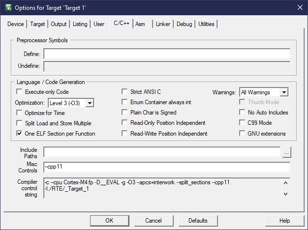

# DLS Project
DLS (Drivable Linear Stage) project is a tiva software project to control a stage with that moves on one axis using stepper motors, limit switches and a motor driver. The project uses a GUI to send instructions via UART serial communication to the tiva that are then interpreted and executed. The instructions are based on the GCode language which allows for flexible and modular instructions that are combined to execute more complex behaviours.

## Installation

This project was written for the Tiva C TM4C123GH6PM microcontroller. As of yet, it hasn't been tested with other tiva microcontrollers. The code is written in and compiled for tiva c++11 for the tiva cpp version and c99 for the tiva c version.

### <u>Compiler Configuration:</u>
Compiler Control String may be subject to change depending on your version of keil. 
Also ensure that your keil support compilation to C++ for the C++ version.

| Version | Compiler Control String | Screenshot |
| :--- | :--- | :--- |
| Tiva Cpp | `-c --cpu Cortex-M4.fp -D__EVAL -g -O0 --apcs=interwork --split_sections --cpp11-I./RTE/_Target_1 -IC:/Users/newuser/AppData/Local Arm/Packs/ARM/CMSIS/5.6.0/CMSIS/Core/Include -IC:/Users/newuser/AppData/Local/Arm/Packs/Keil/TM4C_DFP/1.1.0/Device/Include/TM4C123 -D__UVISION_VERSION="528" -D_RTE_ -DTM4C123GH6PM -o .\Objects\*.o --omf_browse .\Objects\*.crf --depend .\Objects\*.d` | 
| Tiva c | | |

### <u>Setting up the tiva:</u>

### <u>Setting up the python GUI:</u>

## Usage

## License

